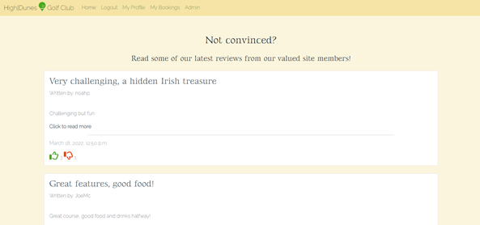
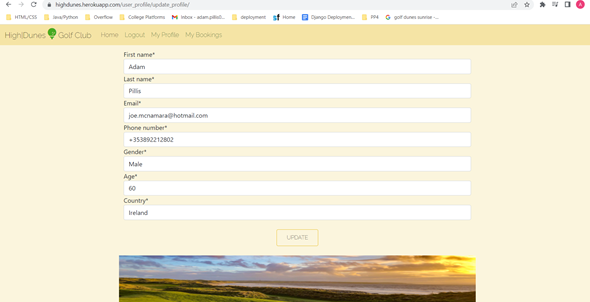
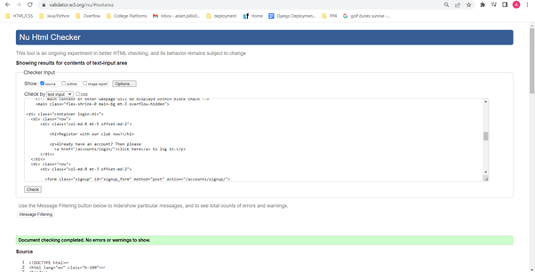

# [HighDunes Golf Club](https://highdunes.herokuapp.com/)

## 1. **Introduction**

### **What is HighDunes Golf Club?**
HighDunes Golf Club is a golf web application designed for site users to interact with one another as well as the golf club itself. Other than a minimum age requirement of 16, no other requirements are needed to make full use of all features for any potential golfer.
HighDunes Golf Club offers.
- Site users are given the ability to create an account with ease (only username and password required) which automatically allows them to start interacting with some features such as *responding to reviews within the landing page*.
- Create a **once-off** profile which is going to be used from there onwards to create tee bookings only within several clicks.
- Once a profile is set up, the site user is given the ability to proceed with a booking by requesting as many as they wish within several clicks only, as long as they are signed in.

HighDunes Golf Club web application is an imaginary golf club i.e. it does not exist. However, the **Project Aim** was to design an interactive website to show the potential of online presence for a golf club of any size, no matter how popular it is. The developer of this application has researched smaller golf clubs and how they present themselves online, collect data and interact with their users. His findings identified a lack of strong online presence. Most clubs only offer user interactivity via social media websites rather than creating their own online presence through which they could enhance business growth and collecting data which they could use to create marketing strategies and understand their potential target market.

For this reason, the developer decided to create an imaginary website which shows off the power of online presence which is becoming a **must** feature for any business with the potential of increasing business growth. 

### **How it works?**

1. The landing page offers a large, appealing image and a welcome message to the user as soon as they reach the website with a *Sign Up Button* to start interacting. On average, it takes three seconds for a user to decide whether they will stay on the site or leave so this has been taken into account as a result and this landing image has almost been designed to fill full view length. The flow of the home page was designed to fulfill site user needs in order.
- What does the golf has to offer (features with images).
- What do other golfers say about the golf course? (reviews section).
- If all is good, where can I sign up? (two sign up buttons on the home page).

2. Given the developers knowledge of golf, he is fully aware of what potential customers are looking for when researching a golfing site. So therefore, the landing image is followed by more photos and short paragraphs which explain the most important features that the golf club offers. The club does not need to look 5 star in reality given that photos of any quality can be resized and styled to look appealing to the eye. 

3. After all of the features are explained briefly, the developer implemented an interactive section where users can view reviews and respond by liking, disliking them and even replying to them. The only requirement to start using this feature is just to create an account. No need for a profile.

4. This is followed by another section where the background image represents a regular image of a golf course in style and another opportunity to *sign up as a user*.

5. Once the user signs up, they are given the ability to create a profile which is only needed once and can be updated by them at any point. This can be reached via the *navigation bar* or if by mistake, they decide to book a tee time, they will be informed that a profile needs to be created before moving on. 

6. Profiles do not require approval, however, when it comes to making a tee time, users will need to wait for approval but users are notified of this once they submit their *tee booking request*.

7. In terms of a user profile, users are only given the ability to create, view and update their profile without approval. In terms of golf bookings, they are given full **CRUD** functionality given that they can create, view, update and delete their approved tee times without contacting the golf shop. 

### **Who is it for?**

Ireland is one of the most popular golfing destinations. With over 220 golf courses and global target audience of 66 million golfers, the potential for business of a golf course of any size is big. Of course, in order to reach a global target market, online presence is almost becoming a *requirement*. International players will want to check out a particular golf they wish to play during their stay so it is important to provide them with essential features such as reviews and golf course features so they can plan ahead and request tee times with special requirements, if any. 

**New Users**

New Users are given the ability to create an account by filling in the username and password section only. Entering an email is optional. Once an account is created by the user, they can proceed to create a profile which only needs to be done **once** and does not contain more than 6 fields. Once complete, they can process and book tee times of any amount of their choice and without needed to fill out personal details again. The booking process only requires several fields to be filled in also.
*New Users* do not need to go further than creating an account in order to start interacting with the site. They can like, dislike and comment under reviews without needing personal details. 

**Returning Users**

As a returning user with a profile already set up, the only requirement before proceeding with a booking or checking the status of a booking is to *log in* and click on *My Bookings*. No need to go into the profile section unless they wish to update their personal details. The user only needs to click on two links and two buttons to request a tee time. 

### **Planning**

##### **Agile Planning Approach from Start to Finish**

The developer used an Agile Approach to start the planning process. **EPIC** User Stories were first collected and reviewed in order to understand what the users would expect to see in such web application, from both a site user and an admin perspective. 

 

Some of these *Epic User Stories* are quite extensive in terms of workload in comparison to one another. Therefore, the developer broke some of these larger epic user stories to smaller user stories in order to be able to plan further and estimate the possible length of time, the project will take altogether. 

On GitHub, he created a new *Issue Template* through which he can break and create each epic user story into smaller user stories i.e. issues. The 21 epics as shown above, have been broken down into 27 different user stories. 

One Agile Tool used was to break these user stories down further. **Acceptance Criteria** and **Tasks** were added to each of these user stories to realise the workload of each and what is expected from each user story. One example is shown below.

 

Another Agile tool used to proceed with these issues was to implement the **MOSCOW Prioratization** and split these User Stories into 4 categories. *Must-have*, *Should-have*, *Could-have* and *Would-have* issues. A *label* for each was created and each issue was labelled in order of importance.
A **Milestone** called *HighDunes Golf Club* was then created where the developer prioratized the user stories in order of importance which offered a clean direction in terms of the overall, project workflow.

**Milestone Start of Project**

 

**Milestone at End of Project**

 

A **New Project** was created on GitHub called *HighDunes Golf Course User Stories* where he had three columns layed out **To do**, **In Progress**, and **Done**. User storiess worked on were moved accross as completed and in order of importance which was followed through the **milestone** created.

Overall, 27 issues were identified. They were further broken down into 142 *tasks*. Once labelled, 16 issues/user stories were identified as **Must-have** in order for the web application to be released with minimum requirements. The remaining 11 issues were a mixture of the other three categories. The 16 *Must-have issues* consisted of 80 *tasks* while the remaining tasks totalled 62 *tasks* which means that *must-have* issues do not exceed the **60%** since *Agile Timeboxing Approach* is used. 

#### **Further Planning**

The style of writing was decided through **Google Fonts**. The main writing is kept thin for a cleaner, more elegent style while the headings style was thicker.

The main theme colors were chosen on [coolors.co](https://coolors.co/palette/a08219-b08f1b-e8bd21-eece59-f4de90-a3d590-75c059-46ab21-36821b-265815) in order to find colours which work together very well and hence, provide a better visual experience for site users.

**Bootstrap** is used to design the overall strucuture of the website on screens of all sizes. 
[startbootstrap.com](https://startbootstrap.com/previews/landing-page) was used to choose the main strucuture of this golf web app. The link above is linked with the specific theme used for this project. 

**Custom CSS** will be used to design the visual look of the website.

**Buttons**

[codepen.io](https://codepen.io/annguyn/pen/xNVprL) was used to select an overall button style for this project.

##### **HTML page structure sketches**

**1. Landing Page** 

The landing page has taken most of its strucuture from the *bootstrap theme* viewable via the link above and the content included in terms of importance. 

**2. Review Page** 

If user clicks on one of the reviews within the landing, how the overall review is strucutured on its separate html page.

**3. View Bookings Page**

When the user clicks on bookings within the nav bar, what the structure of this page would look like.

**4. View Profile Page**

When the user clicks on Profile within the nav bar, what the profile page strucuture would look like.

**5. Add booking, update_booking, create_profile, update_profile pages**

All of the above pages will consist of forms created through applications so therefore, different forms but same styling.

**6. Delete Booking page**

Instead of automatically deleting a booking, this page will work as defense to ensure the user wants this CRUD funcitonality to proceed, as it cannot be reversed. 

**7. AllAuth custom Sign Up, Log In, Log Out pages**

All of these html pages provided by allauth include different forms so therefore, the styling of all these can also be identical. 

#### **Workflow Process**

The workflow process for *New Users* and *Returning Users* when interacting with the features included within this website. 

#### **Project Apps and Relationships**

Overall, three main applications will be built the very least while using *Django AllAuth's user model*. 

Four different models were also planned within these three applications and how they will be linked to each other. 

The **CRUD** functionality was also planned for each application. i.e. to what extent can a Site User or Admin manipulate data built from the models as shown above. 

## 2. **Features (existing)

In terms of text use for interacting with users on the website, each paragraph was written as it was directed to a specific user so that they feel included and nothing sounds too form to keep their mood and website atmosphere warm overall. 

All of the *button* throughout all html pages are styled and colored consistenly for enhanced visual look from a user point of view.

The background color of each html page is also kept identical. 

### 1. **Landing Page**

#### **Header**

The header will be included within the base.html page which is going to be included within every html page and its style will also be set to sticky mode so that it follows the user to prevent from having to scroll up to the top of the page to access a feature within the nav bar.
It contains the golf club *logo style* while it takes up small space to allow other sections to stand out. When screen size reaches medium, the nav bar list elements are automated into a dropdown box to enhance UX design on smaller screen sizes and maintain size of header. The nav bar list elements consist of vital application urls.

**Not Signed In**

If the user is not signed in, only three features are visible.

1. **Home**
2. **Register**
3. **Login**

**Signed In as Site USer**

If the user is signed in, list elements visible change, apart from the *Home Tab*. The nav elements are named from the user point of view and hence, **My** is placed before profile and bookings. 

1. **Home**
2. **Logout**
3. **My Profile**
4. **My Bookings**

**Signed In as Admin**

If signed in as Admin, an additional element is visible as well as the above which provides the superuser with access to the admin panel where they can fully control all of their users, profiles, reviews, comments and bookings.

5. **Admin**

#### **Landing Page Image and message**

The size of the landing image is almost 100VH and its main aim is to catch the attention of any site visitor within the first three seconds as mentioned within the planning process above. The colours within the image blend in with the overall colours used for the website and in terms of quality, it also stands out on all screen sizes.

A warm welcome message is displayed within the image to start communicating with all site users. The new site user is told that the sign up process will not take long. The golf club's age requirement is also explained while a stylish **Sign In** button is placed underneath to prevent a user from having to look around for a sign in option. Of course, as a returning user, they will be aware that the *all features can be reached via the nav bar*.

#### **Feature's Section**

The features sections consists of three parts/golf club features which can look very tempting for any golfer. 

1. **Clubhire**
2. **Golf Buggies**
3. **Halfway House**

Most of the time, these three features alone can answer the first several questions of any golfer regarding a golf course which is why they were chosen. Short paragraphs explain each in details so users don't have to read *too much* while the images above each text are styled elegantly. The header of each part was also worded so that golfers don't need to the paragraphs underneath in order to understand what is available. 

#### **Showcase Images**

The showcase images provide further features and information regarding the golf course which will answer further questions of golfers.

Again, the headings were chosen so that the paragraphs underneath do not have to be read if a user is not interested in small text. The images become full width on smaller to medium devices to enhance image display to users on mobile and tablet screens.

**Showcase Image 1 - Driving Range**

**Showcase Image 2 - Twilight Golf**

**Showcase Image 3 - Course Design**

#### **Review Section**

The heading of this section also demonstrates how the website interacts with each user as if it was a **one to one** conversation.

This section lists three reviews per page and displays most of the data for each review. A signed in user has the ability to like or dislike a review which is not a feature available through the landing page but the number of likes and dislikes are displayed so that the user is aware what golfers agree with and what they disagree with i.e. what to look out for without needing to click on a review.

#### **Sign Up Section**

This section contains an image of a golfer playing an ordinary golf course, yet still appealing to the eye. A text box directly aiming at the site user is also displayed, making a statement and also asking them a question with a possible answer of **Signing Up**. Hence, a button is provided which is linked with the sign up html page. 

#### **Footer**

The footer is included within **base.html** to ensure that the user has access to all of the clubs social media sites and to mainain consistency through all html pages as well as the header with the nav bar. 

The background color of the icons match the color of the buttons for more consistency. 

### 2. **Review Page**

The review page appears when a user clicks on a specific review within the landing page. This page displays all of the review details.

The base.html is extended. The style of image and review title is identical for every review.
Within this page, the user is given the ability to interact with the review by liking, unliking, reviewing comments and even leaving a comment themselves if they so wish. 

The number of likes, dislikes and comments are also displayed within each review.

A back to home **button** is placed at the bottom of the page so the user can exit back to the landing page without needing to *click to go back*.

**Not Signed In**

If the user is not logged in, they have no access to any of the interactive features. The user can only view the review in detail.

**Signed In**

If the user is *signed in*, they have full access to all of the features within each review. The like and dislike icons change style to colors *red* and *green* which they can click once to add or twice to remove. 

The **leave a comment** feature also comes available to the user so they can just enter their comment. Their username is taken automatically and once submitted, they receive two messages. One at the bottom to make them aware that their "*comment is awaiting approval*" and one at the top to ensure they are aware their "*comment has been received and will be displayed once approved by the admin*".

If the user logged in is the **superuser**, then the need to approve the comment is lifted and the manager of HighDunes Golf Club can freely leave comments of their choice without approval required. 

### 3. **Profile Page**

This page or feature can only be accessed by users who have successfully registered or logged in via **My Profile** in the nav bar. Once a profile is created, it is presented using **Bootstrap cards**. 

An image is placed at the bottom at full width size on all screen sizes to bring in some style to the page while representing the main theme of the website i.e **golf**.

**Without Profile Created**

If the user is new to the website and just finished registering, they would not have a profile set up yet. Therefore, a message is displayed letting them know that "*A Profile does not exist for them*". The one requirement which is the minimum age is again highlighted.

A **Create Profile** button is presented underneath the above text for them to click on which takes them to the *add_profile page* where they can create their profile.

**With Profile Created**

If the user is a returning user or has just created their profile, their profile details are displayed within a *bootstrap card* which is styled and two new buttons appear underneath their profile details. Looking at it from a site user's point of view, the following two buttons cover what the user would possibly like to do from this point i.e. *update their profile* or *make a booking*.

**Update Profile**: Takes the user to the "*edit_profile*" page where they can update their profile data model.

**New Booking**: Offers a direct link to making a new booking. This feature is only visible because the profile is created. If this was available before a profile is created, this could crash the website as each booking required profile details. 

The full width image at the bottom but above the footer is there to improve the page design and the same is used to maintain consistency throughout the website. 

### 4. **Booking Page**

This is the page where all user bookings are listed and full CRUD functionality is available to the user. The image and title at the top of the page is almost identical to the *review page* design for consistency as well as the image just above the footer and they both shrink and change design as the screen size gets smaller.

**Without Profile Created**

Without a booking created, the user is presented with a feedback message that states *The user needs to create a profile before proceeding with a booking. The *New Booking* button is hidden and the user's only option is to create a profile first before interacting further.

**With Profile Created but without Booking**

Once the user has created a profile, the **New Booking** button appears and allows them to request a booking through the add_booking view function which appears within a styled form page. Nothing else is presented on the page until the user requests a booking. 

**With Profile, one confirmed booking and one waiting for approval**

Once a booking is complete and the user submits the form, the response they are given is through a django message which appears at the top of the page "*Your booking has been received and is waiting for approval*".

Once the superuser approves the booking, the booking details appear to the user with **Confirmed** at the very top. **Two** buttons are presented to the user to allow them to use the other two of the CRUD functionality which is to:

**Update**: Takes the user to edit_booking page where an instance of their booking appears within a preset form and they can update it as they wish. Of course, when the user submits, the booking_status automatically changes to Pending and will need superuser approval again. 

**Delete**: Takes the user to the *delete_booking.html* which acts as a form of defense to ensure the user wants to delete data from the database. This is necessary because once the data is deleted, it cannot be returned. 

### 5. **Delete_booking Page**

This html page was created to ensure that the user wants to complete the last section of the CRUD functions i.e. the last step. Once it is deleted, it cannot be returned so therefore, the user is prevented from achieving this with one click but instead, they're taken to this page where a final warning question appears which states the **date** and **time** of the game booked.

**Submit Button**: Completes the final step of CRUD. Deletes the booking for good and cannot be reversed. Once the clicked, the *view_bookings page* is updated, refreshed and the user is returned here while a feedback message appears at the top to confirm *The booking has been deleted*. 

**Cancel**: Returns the user to the *view_bookings page* without deleting the booking. 

### 6. **Custom created Form Pages**

All of the custom created form pages below are listed together because they are all designed almost identically to maintain consistency of custom form presentation and display. The *buttons* displayed in all of these pages are also identical.

**add_booking.html**

This html page is used to display the form created within forms.py of the *golf_booking application*. Given that the user has filled in their profile, profile model data is used to autofill personal details within views.py and only essential questions are asked to reduced the length of time it takes the potential customer to book a tee time.

Out of the six fields provided, only four are required which are basically dropdown options to enhance user interaction by not asking them to type unless they have something additional to request within *extra requests* or if they wish to hire clubs, just simply *tick the box*.

**update booking** Called from **view_bookings.html** - **Update Button** the same add_booking.html page is used with the booking form but instead, using the booking ID and user details logged in, it creates an instance of the user booking details which the user can change as they wish. The booking status is changed to "Pending" once again once the submit button is clicked.

**create profile**

When a user creates an allauth account, an empty profile is created for them through *signals.py*. Within forms.py, a custom form is created to represent the profile data model with essential personal details. Every field is required to ensure that the user experience is maintained high and prevent the website from crashing if a field is left blank i.e. directly linked with bookings which requires personal details to function correctly. 

The html page used to render this form is update_profile.html

**update profile**

The update_profile.html is used again to display this feature to the user for consistency. An instance of the logged in users profile is created within the form instead which the user can update and submit without needing approval and the changes are automatically updated and visible within the *view_profile page*.

### 6. **AllAuth Form Pages**

All of the allauth form pages are designed and styled almost identically for better user experience. Buttons are styled identically again with an image displayed just abover the footer to keep the overall UX design style.

**Sign Up Page**

Only consists four fields of which only three is required. Of course looking at it from a user's point of view, they may click here by mistake so a **click here** is created at the top of the form which is liked with the *log in page*.

The new user only needs to provide a username and a strong password which is validated through AllAuth.

**Log In Page**

Given the fields required to sign up, the user is only asked for a **username** and **password** to log in. From a user's perspective, incase they clicked on this tab instead of *Register*, a **sign up now** link is displayed for the user that they can click to be directed to the *Sign Up Page*.

The **Remember Me** feature is available to the user to *tick* so that their log in details are saved to improve their future booking experience. 

The **Sign In** button logs the user in and the *nav bar elements* displayed change accordingly.

**Log Out Page**

Once the user is logged in, the **LogOut** nav element comes available to them. However, rather than this function being a once click option, when the user clicks on the log out element, it directs them to the log out page where it is double checked before proceeding with this feature. 

A **cancel** link is displayed to the user if they have changed their or if they clicked on this option by mistake. It redirects the user back to the home page. 

However, if the user wishes to continue, they just have to simply click on the styled **Sign Out Button**.

### 7. **AllAuth Admin Panel**

The developer of this website created a nav bar element called **Admin** which only appears if the user logged in is the superuser (manager). This element is linked with Django's admin panel through which the manager is granted all of the CRUD functionality of all custom applications created as well as allauth's **user model**. They are given the ability to return to the website at any point through the link in the top right corner.

## Features (new ideas) 

As the developer progressed with this project, he discovered lots of new potential features which could be implemented into this project to make it more interactive and attractive to site users/golf players. 

- Make the email field within AllAuth signup.html required and use to implement new features such as **Confirm Email** and use it to **Change Password** and hence, design these features to match the main theme. 

- Allow users to create reviews using the review model or import reviews from other sites like social media sites, Tripadvisor or golf course pages. The section provided for the reviews could be used for this feature while keeping other user interactive features such as like, dislike and reply.

- For now, the golf clubs booking system is manual and the golf shop needs to manually approve bookings but the next update could implement a new *Application* in which a daily tee sheet is created within models.py for each day. This application would be directly linked with the *golf_bookings* application and all of its data would be used within the new application. Given that the new daily tee sheet model will contain dates and time slots, this can be linked with the date and time fields of each booking. Number of available clubs, buggies available for the day could also be implemented so that bookings can automatically be confirmed and the time booked cannot be booked twice. For now, the time slots differ by 30 minutes to give space for double, even triple bookings if needed. This is definitely a potential feature which will now be planned by the developer and included in the future. 

- Include an **image gallery**, **halfway house menu**, **google maps to show the location of the course**, information regarding the **golf pro** and an about section for the **Golf Club itself**.

- Search field at the top of the landing page so the user can search for specific features within the website.

- Include some live features such as a video imported from *Youtube* which shows the layout of the course, given that the golf course has a video of their course on 'Youtube'.

## 3. Testing and Bugs Fixed/Unfixed

HighDunes Golf Club project testing has been broken down into several stages, given its complexity and reliance on a database and deployment.

#### **Validator Testing**

Validation testing for this project include HTML, CSS, little Javascript and Python code validation. 

**Validating HTML Pages**

[https://validator.w3.org/](https://validator.w3.org/) is used to test all html files and their code to ensure high coding standards. Base.html is not tested given that the following html pages would not work without it and the content within the base.html is displayed correctly.

All of the testing below was done through the source code of each page on the **deployed** version of the project.

**index.html**

**review_page.html**

**view_profile.html**

**update_profile.html**

**view_bookings.html**

**add_booking.html**

**delete_booking.html**

**signup.html**

**login.html**

**logout.html**

**Validating CSS file**

[https://validator.w3.org/](https://jigsaw.w3.org/css-validator/) is used to test CSS files and their code to ensure high coding standards.
Only one css file within this project which is located in *static/css/styles.css*

**style.css**

**Validating JavaScript file**

[https://jshint.com/](https://jshint.com/) is used to test js files and their code to ensure high coding standards.
Only one js file within this project which is located in *static/js/script.js*

**script.js**

**Validating Python files**

[http://pep8online.com/](http://pep8online.com/) is used to test Python files and their code to ensure high coding standards.

1. #### feedback Application

Testing every custom python file within this application.

**admin.py**

**forms.py**

**test_forms.py**

**models.py**

**urls.py**

**test_urls.py**

**views.py**

2. #### golf_booking Application

Testing every custom python file within this application.

**admin.py**

**forms.py**

**test_forms.py**

**models.py**

**urls.py**

**test_urls.py**

**views.py**

3. #### user_profile Application

Testing every custom python file within this application.

**admin.py**

**forms.py**

**test_forms.py**

**apps.py**

**signals.py**

**models.py**

**urls.py**

**test_urls.py**

**views.py**

4. #### highdunes Application

Testing files with some custom python code within main project

**urls.py**

**settings.py**

Five errors show for this file on PEP8. Four of these is shown within PEP8 which was automatic and unable to break into several lines.
The fifth one a static var which is similar to the above four.

**Light-house Report**

Within DevTools, the lighthouse report is used to test overall performance of the website.

Performance has been categorised and is the only element not above 90% given that some of the images take much longer to load given their size i.e. main landing image which is essential to be good quality and big to attract new site visitors.

**Landing Page**

**View Reviews Page**

**View Profile Page**

**View Bookings**

**Delete Bookings**

**Register Page**

**Log In Page**

**Logout Page**

### **Testing colour contrast**

[Coolors.co/palette](https://coolors.co/palette/a08219-b08f1b-e8bd21-eece59-f4de90-a3d590-75c059-46ab21-36821b-265815) site was used to chose the color theme for the project as it provides a set of colors which work well together and the contrast perfect.

### **Search Engine Testing**

This project was tested through three several search engines including Google Chrome which is the creator's default search engine. Internet Explorer was not included below given its lack of popularity. 

1. **Google Chrome (default)**

2. **Mozilla Firefox**

Each section displayed as a page was tested and checked through *Mozilla Firefox* and no issues detected.

**Landing Page**

**View Reviews Page**

**View Profile Page**

**View Bookings**

**Delete Bookings**

**Register Page**

**Log In Page**

**Logout Page**

**Admin Page**

3. **Microsoft Edge**

Each section displayed as a page was tested and checked through *Microsoft Edge* and no issues detected.

**Landing Page**

**View Reviews Page**

**View Profile Page**

**View Bookings**

**Delete Bookings**

**Register Page**

**Log In Page**

**Log Out Page**

**Admin Page**

### **Application Features Test**

#### **Automated Testing**

Some automated testing has been completed on this project. This website consists of three separate applications. Within each of these, files **urls.py** and **forms.py** have been tested and overall, **16** automated tests are running error free and each test was further testing by inserting unexpected data to ensure tests are running as they should.

**1. feedback application**

**test_forms.py**: Two automated tests running successfully to check if everything functions with correct data and test for correct number of errors (required fields) come back when no data is submitted. 

**test_urls.py**: Four automated tests running successfully to check all CRUD functionality url paths.

**2. golf_booking application**

**test_forms.py**: Two automated tests running successfully to check if everything functions with correct data and test for correct number of errors (required fields) come back when no data is submitted. 

**test_urls.py**: Four automated tests running successfully to check all CRUD functionality url paths.

**3. user_profile application**

**test_forms.py**: Two automated tests running successfully to check if everything functions with correct data and test for correct number of errors (required fields) come back when no data is submitted. 

**test_urls.py**: Two automated tests running successfully to check CRUDs functionality url paths.

#### **Manual Testing**

While the developer is fully aware of the advantages of full automated testing, he made a decisions to test the rest of the project manually in detail as result of the **upcoming due date**.

**1. Index.html features**

- **Header - NavBar**
    - **Header logo and club name** reloads index.html = **true**
    - **Home** reloads index.html = **true**
    - **Register** only visible if logged out = **true**
    - **Register** only visibile if logged out = **true**
    - **Register** loads signup.html = **true**
    - **Login** loads login.html = **true**
    - **LogOut** only visible if logged in = **true**
    - **LogOut** loads logout.html = **true**
    - **My Profile** only visible if logged in = **true**
    - **My Profile** loads view_profile.html = **true**
    - **My Bookings** only visible if logged in = **true**
    - **My Bookings** loads view_bookings.html = **true**
    - **Admin** only visible to superuser(manager) = **true**
    - **Admin** loads view_profile.html = **true**

- **Main Landing Image**
    - zooms in page loads/reloads = **true**
    - "Sign Up" button hover effect = **true**
    - "Sign Up" button redirects to *signup.html* = **true**
    - "Sign Up" button, if logged in, reloads index.html = **true**

- **Review Section**
    - 3 reviews per paginated page = **true**
    - CSS styled like/dislike icon displayed = **true**
    - Hover effect on *Title* = **true**
    - Title renders review_page.html = **true**
    - Hover effect on *Click to read more* = **true**
    - *Click to read more* renders review_page.html = **true**
    - "Next" button redirects to *index.html* = **true**
    - "Next" button loads new reviews in *index.html* = **true**

- **Sign Up Section**
    - "Sign Up" button hover effect = **true**
    - "Sign Up" button redirects to *signup.html* = **true**
    - "Sign Up" button, if logged in, reloads index.html = **true**

- **Footer Section**
    - Icons equally positioned = **true**
    - Icons background color match buttons = **true**
    - Icons hover effect match anchor hover effect in terms of colour = **true**
    - *Facebook* icon visible = **true**
    - *Facebook* icon linked with Facebook URL = **true**
    - Facebook URL opens in new tab = **true**

    - *Twitter* icon visible = **true**
    - *Twitter* icon linked with Twitter URL = **true**
    - Twitter URL opens in new tab = **true**

    - *Instagram* icon visible = **true**
    - *Instagram* icon linked with Instagram URL = **true**
    - Instagram URL opens in new tab = **true**

    - *Youtube* icon visible = **true**
    - *Youtube* icon linked with Youtube URL = **true**
    - Youtube URL opens in new tab = **true**

- **2. Register.html features**
    - *Click here* header link hover effect = **true**
    - *Click here* loads login.html = **true**
    - *Username field* required = **true**
    - *Email field* NOT required = **true**
    - Password required and validated = **true**

    - User feedback message "Successfully signed in displayed" = **true**
    - "Sign Up" button hover effect = **true**
    - "Sign Up" button submit allauth user form = **true**

- **3. login.html features**
    - *Sign up now* header link hover effect = **true**
    - *Sign up now* loads signup.html = **true**
    - *Username field* required = **true**
    - Password required and validated = **true**
    - Remember Me feature visible = **true**
    - "Sign In" button hover effect = **true**
    - "Sign In" button submits allauth user sign in form = **true**
    - User feedback message "Successfully signed in as username" = **true**

- **4. logout.html features**
    - *Click here* link hover effect = **true**
    - *Click here* loads index.html = **true**
    - "Sign Out" button hover effect = **true**
    - "Sign Out" button submits allauth user sign in form = **true**
    - User feedback message "You have signed out" = **true**

- **5. view_profile.html features**

    **Without Profile**
    - *No Profile* user message displayed = **true**
    - *Create Profile* button displayed = **true**
    - *Create Profile* loads update_profile.html = **true**
    - *NO* other buttons visible = **true**

    **With Profile**
    - **Profile** displayed in card = **true**
    - *Update Button* button displayed = **true**
    - *Update Button* button loads update_profile.html = **true**
    - *New Booking* button displayed = **true**
    - *New Booking* button loads add_booking.html = **true**
    - User feedback message "Successfully signed in as username" = **true**

- **6. update_profile.html features**

    This form has two automated tests, one to test all fields are required and one to ensure if correct details are entered, data is saved as expected. This html page and form are both used to **Create** and **Update** user profile. The difference is that the *Update Button* calls a different view function which uses an instance of the current user's profile.

    All of the 7 form fields are validated using django forms. 

    - **Update Button** button displayed = **true**

    - **Update Button** hover effect = **true**

    - **Update Button** overwrites existing profile data = **true**

    - **User feedback** message "You're profile has been successfully updated" displayed = **true**

- **7. view_bookings.html features**
    - **New Booking** button displayed = **true**
    - **New Booking** hover effect = **true**
    - **New Booking** loads add_booking.html = **true**

    - **Home Page** button displayed = **true**
    - **Home Page** hover effect = **true**
    - **Home Page** loads index.html = **true**

- **8. add_booking.html features**

    This form has two automated tests, one to test for number of errors which should be two given that 4 out of 6 fields are required. The other test is to ensure if correct details are entered, data is saved as expected. This html page and form are both used to **Create** and **Update** user bookings. The difference is that the *Update Booking* button calls a different view function which uses an instance of the current user's booking and finding it using it booking_id.

    All of the 4 (required fields) are validated using django forms as well as the other two, if changed.

    **Number of holes**: 9 or 18 = **true**

    **Number of players**: 1 to 4 max = **true**

    **Club Hire**: default set to false = **true**
    
    **Play date**: calander widget to set correct format = **true**

    **Play time**: custom choices every 30 mins = **true**

    **Extra requests**: optional = **true**

    - **Request Now** button displayed = **true**
    - **Request Now** button hover effect = **true**
    - **Request Now** button submits booking form = **true**
    - **Request Now** button reloads view_bookings.html = **true**

    - **User feedback** message "Your booking has been created and now waiting for approval." displayed = **true**
    - **User feedback** message "Your booking for ..... at ... is awaiting for approval. Please check back later." displayed = **true** 

    **Booking "Confirmed" by superuser"**
    - **Booking Details** appear in a card = **true**
    - **Profile Details** autofill personal details = **true**
    - **Update** button appear in a card = **true**
    - **Update** button loads add_booking.html with instance data form = **true**
    - **Request Now** overwrites data and booking_status set to False = **true**
    - **User feedback** message "Your update request has been received for approval." displayed = **true**

    - **Delete** button appear in a card = **true**
    - **Delete** button loads delete_booking.html = **true**

- **9. delete_booking.html features**

    - **Warning Message** includes first name, date and time of booking = **true**

    - **Submit** button displayed = **true**
    - **Submit** button hover effect = **true**
    - **Submit** button submits delete request = **true**
    - **Submit** button reloads view_bookings.html = **true**
    - **User feedback** message "Your booking has been deleted." displayed = **true**

    - **Cancel** button displayed = **true**
    - **Cancel** button hover effect = **true**
    - **Cancel** button reloads view_bookings.html = **true**

- **10. review_page.html features**
    - **Review Details** displayed with no errors = **true**

    **IF LOGGED IN**
    - **Thumbs Up** icon counter increments by 1 if user clicks = **true**
    - **Thumbs Up** icon counter decrements by 1 if user clicks twice = **true**

    - **Thumbs Down** icon counter increments by 1 if user clicks = **true**
    - **Thumbs Down** icon counter decrements by 1 if user clicks twice = **true**

    - **Comment Counter** functioning correctly = **true**

    - **Review comments** data displayed with no errors = **True**

    **IF LOGGED IN**
    - **Leave a comment** section visible to logged in user = **true**
    - **username** appears and only text area visible to the user = **true**
    - **Required** comment content = **true**

    **IF COMMENTED AND SUBMITTED**
    - **User thank you message** "Thank you for your comment." displayed = **true**

    - **User feedback** message "Your comment is awaiting approval" displayed at the bottom of page = **true**

    - **Back To Home** button loads index.html = **true**

### **Testing Responsiveness**

[Am I Responsive](http://ami.responsivedesign.is/) website was used to test the responsiveness of HighDunes Golf Web Application on several devices deferring in sizes "from small to large".

This website was also used to test the web features on all screen sizes.

**Register Page**

**Log In Page**

**Log Out Page**

This page is 100% responsive to all screen sizes and hass been tested on multiple devices. Unfortunately, unable to show "Am I Responsive" screenshot given that access to log in is denied through this responsiveness app so the developer can only display the urls which load on it. This url does not load unfortunately.

**Landing Page**

**View Reviews Page**

**View Profile Page**

**View Bookings**

This page is 100% responsive to all screen sizes and hass been tested on multiple devices. Unfortunately, unable to show "Am I Responsive" screenshot given that access to log in is denied through this responsiveness app so the developer can only display the urls which load on it. This url does not load unfortunately.

However, the add booking.html page url did.

**Delete Bookings**

### **Other ways of testing responsiveness and features**

Multiple family members and friends were asked to test this new application on their mobile phones and overall, the only mobile identifying some margin errors was the **Samsung Galaxy S8**. Another issue discovered was the user email field within the signup.html caused the website to crash and show **500 Error** page if the user added their email as well as their username. 

### **Fixed Bugs**

1. The margin issue identified above was an easy fix by increasing the margin of a specific div element. The **error bug** has also been rectified as it is left optional but no longer causes an issue since the email verification method has been disabled in settings.py. 

2. Throughout the project, the developer set the url path for most images within **style.css** file to style each image within one element. However, this caused some bugs when the project was deployed and the images with URLs in style.css did not load.
The reason for this was simply that it could not load **statically** given that those *images* are custom so thereforce, image urls had to transfered to HTML image tags and styled accordingly with a new div box. This ensure that the  would load all images with no more errors. 

3. django's allauth built in calender within dateField worked perfect within the admin panel, however, it did not display identically within the BookingForm and expected the user to know the exact format. Django Forms *Date Input* widget was used within forms.py which is linked with the DateField within the BookingForm which has solved this bug.

4. At the start of the project, the developer had a major issue not being able to load his custom style.css file which he then rectified by setting his **css link** and **js link** within the base.html to **url static** which solved this bug.

### **Unfixed Bugs**

One identified bug which has not been solved but does NOT cause any visual or error bug. The optional email field with signup.html could not be removed unless a custom form was created but to ensure no further bugs were created, the developer decided not to create one. The email field saves the email but it is not linked with the user_profile application and hence, the user will be asked to enter their email address again. To solve this, a new custom user form needs to be created which would be the next step from here but for now, it does not conflict with any other part of the application.

Other than this, no other bugs or issues found have been left unsolved. 

## 4. Deployment

For deployment, GitHub is used to push data from production environment and HEROKU is used to run the web application and POSTGREs database. 

The steps needed to take to deploy this project are as follows: 

**In Gitpod** - After project set up and libraries required installed to workspace.

**1.** Create **requirements.txt** file and ensure it is **up to date** before deployment.

**In Heroku**

**2.** Create the **Heroku app**.

**3.** Attach the **POSTGRES database** to the app **through *Resources* tab**.

**4.** Copy DATABASE_URL value which is located in the Settings Tab, click reveal Config Vars, Copy Text.

**In Gitpod**

##### *env.py*

**5.** Create new **env.py file** on top level directory.

**6.** **Import os library**.

**7.** Set **environment variables** to "**os.environ["DATABASE_URL"] = "Paste in Heroku DATABASE_URL Link**".

**8.** Add in **secret key** - **os.environ["SECRET_KEY"] = "HighDunes own secret key"**.

**In Heroku**

**9.** Add Secret Key to ** - **SECRET_KEY, HighDunesSecretKey**.

**In Gitpod**

##### *settings.py*

**10.** Reference **env.py** like below.

**import os**
**import dj_database_url**

**if os.path.isfile("env.py"):**
   **import env**

**11.** **Remove** the insecure **secret key** and replace - links to the **SECRET_KEY variable on Heroku**

**SECRET_KEY = os.environ.get('SECRET_KEY')**

**12.** **Comment out** the old DataBases Section

DATABASES = {
    'default': {
        'ENGINE': 'django.db.backends.sqlite3',
        'NAME': BASE_DIR / 'db.sqlite3',
    }
}

**13.** Add **new DATABASES** Section (links to the DATATBASE_URL variable on Heroku)

DATABASES = {
   'default': dj_database_url.parse(os.environ.get("DATABASE_URL"))
}

**14.** In terminal, save all files using **git push** and **migrate** all data models to make they're up to date.

**In Cloudinary.com**

**15.** Copy **CLOUDINARY_URL** from **Cloudinary Dashboard**.

**In settings.py**

**16.** Add Cloudinary URL to **env.py** **(os.environ["CLOUDINARY_URL"] = "cloudinary://************************")**.

**In Heroku**

**17.** Add **Cloudinary UR** to Heroku through app **settings tab**, **Config Vars** e.g. COUDINARY_URL, cloudinary://************************

**18.** Add **DISABLE_COLLECTSTATIC** to Heroku **Config Vars** (temporary) (**DISABLE_COLLECTSTATIC, 1**)

**In settings.py**

**19.** **Add** Cloudinary Libraries to **installed apps** in settings.py.

INSTALLED_APPS = [
    ,
    **'cloudinary_storage'**,
    **'django.contrib.staticfiles'**,
    **'cloudinary'**,
    ,
]

**20.** In **settings.py** tell django to **use cloudinary to store media and static files**.

STATIC_URL = '/static/'

STATICFILES_STORAGE = 'cloudinary_storage.storage.StaticHashedCloudinaryStorage'
STATICFILES_DIRS = [os.path.join(BASE_DIR, 'static')]
STATIC_ROOT = os.path.join(BASE_DIR, 'staticfiles')

MEDIA_URL = '/media/'
DEFAULT_FILE_STORAGE = 'cloudinary_storage.storage.MediaCloudinaryStorage'

**21.** Link file to the templates directory in Heroku (place under the BASE_DIR line).

TEMPLATES_DIR = os.path.join(BASE_DIR, **'templates'**)

**22.** Change the templates directory to TEMPLATES_DIR (place within the TEMPLATES array).

TEMPLATES = [
    {
        ,
        'DIRS': **[TEMPLATES_DIR]**,
       ,
            ],
        },
    },
]

**23.** Add **Heroku Hostname to ALLOWED_HOSTS**.

ALLOWED_HOSTS = [**"PROJ_NAME.herokuapp.com"**, "localhost"]

**24.** Create **3 new folders** on top level directory (**media, static, templates**).

**25.** Create **procfile** on the top level directory called **Procfile**.

**In Procfile**

**26.** Add the following: **web: gunicorn PROJ_NAME.wsgi**.

**27.** **Git Add, Commit and Push** to save files.

**28.** Once project is complete:

- In Heroku, **config var**s, remove **DISABLE STATIC**.

- In GitPod, go to **settings.py** and set **DEBUG** to **False**.

**29.** **update requirements.txt** (pip3 freeze....).

**30.** Finally, **save** files again. (**Git add, commit, push**).

**31.** In Heroku, go to the **Deploy tab** and *link* github project with Heroku app.

**32.** Scroll to the bottom, **enable automatic deploys** for further changes.

**33.** Click on **Deploy Branch**.

**34.** Go to **Actions Tab** and monitor deployment.

## 5. Credits

### **Content**

#### **Images**

**Main Landing Image**

**owner** = Doonbeg Golf Course

**Link**: [https://gngcd-qnewmedia2.netdna-ssl.com/assets/img/doonbeg/gallery/3.jpg?v3](https://gngcd-qnewmedia2.netdna-ssl.com/assets/img/doonbeg/gallery/3.jpg?v3)

**view_reviews and view_bookings image**

**owner** = Pixabay

**Link**: [https://pixabay.com/photos/golf-golfed-sunset-sports-golfer-787826/](https://pixabay.com/photos/golf-golfed-sunset-sports-golfer-787826/)

**view_profile and view_bookings image**

**owner** = Harisonburg Golf Course in Images Squarespace

**Link**: [https://images.squarespace-cdn.com/content/v1/529f760ae4b0dfa4e475bf47/1554506235287-V6J9M1ZWUHT6NTW6G14H/golf-courses-in-harrisonburg-va-1500x609.jpg?format=2500w](https://images.squarespace-cdn.com/content/v1/529f760ae4b0dfa4e475bf47/1554506235287-V6J9M1ZWUHT6NTW6G14H/golf-courses-in-harrisonburg-va-1500x609.jpg?format=2500w)

**add/update profile and add/update booking**

**owner** = Your Irish Adventure

**Link**: [https://youririshadventure.com/wp-content/uploads/2020/07/golf-courses-in-ireland-1.jpg](https://youririshadventure.com/wp-content/uploads/2020/07/golf-courses-in-ireland-1.jpg)

**signup.html and login/logout.html Image**

**owner** = Palmares Ocean Living & Golf Resort in Lagos (subject to copyright)

**Link**: [https://palmaresliving.com/golf-course/](https://palmaresliving.com/golf-course/)

**Clubhire Image**

**owner** = Cargest, Malaga (ALL SUBJECT TO COPYRIGHT)

**Link**: [https://www.cargest.com/wp-content/uploads/2021/09/malaga-golf-club-hire.webp](https://www.cargest.com/wp-content/uploads/2021/09/malaga-golf-club-hire.webp)

**Buggies Image**

**owner** = Real Irish Golf

**Link**: [https://www.realirishgolf.com/wp-content/uploads/2018/11/golf-cart.jpg](https://www.realirishgolf.com/wp-content/uploads/2018/11/golf-cart.jpg)

**Halfway House Image**

**owner** =  DepositPhotos

**Link**: [https://st3.depositphotos.com/6759912/12521/i/450/depositphotos_125214068-stock-photo-hot-dog-with-cold-beer.jpg](https://st3.depositphotos.com/6759912/12521/i/450/depositphotos_125214068-stock-photo-hot-dog-with-cold-beer.jpg)

**Driving Range Image**

**owner** =  Hartford golf Club

**Link**: [https://images.squarespace-cdn.com/content/v1/59b437c303596ecddfefb87d/1513201484513-UNNMFG98PYVFTWSQKKKX/DSC01539.JPG](https://images.squarespace-cdn.com/content/v1/59b437c303596ecddfefb87d/1513201484513-UNNMFG98PYVFTWSQKKKX/DSC01539.JPG)

**Twilight Image**

**owner** =  Static Flicker

**Link**: [https://live.staticflickr.com/1229/5105065871_e6ffdf2a56_b.jpg](https://live.staticflickr.com/1229/5105065871_e6ffdf2a56_b.jpg)

**Course Layout Image**

**owner** =  Golf Digest

**Link**: [https://golfdigest.sports.sndimg.com/content/dam/images/golfdigest/fullset/2021/10/congressional%20renovated%20photos%20%20%20%20.jpg.rend.hgtvcom.966.725.suffix/1635163082705.jpeg](https://golfdigest.sports.sndimg.com/content/dam/images/golfdigest/fullset/2021/10/congressional%20renovated%20photos%20%20%20%20.jpg.rend.hgtvcom.966.725.suffix/1635163082705.jpeg)

**Register section Image**

**owner** =  Golf Digest

**Link**: [https://www.golfdigest.com/content/dam/images/golfdigest/fullset/2020/03/16/5e6ff536e19847e9c2d0783a_solo-golfer-on-course.jpg](https://www.golfdigest.com/content/dam/images/golfdigest/fullset/2020/03/16/5e6ff536e19847e9c2d0783a_solo-golfer-on-course.jpg)

### **Website Icons**

[https://fontawesome.com](https://fontawesome.com/v5/search) was used to download all of the icons displayed within this project.

### **Website Structure Layout**

[https://startbootstrap.com](https://startbootstrap.com/previews/landing-page) was used to find a web layout theme and the link demonstrate the exact one followed.

Code Institute's **Blog Project** was also taken into consideration when designing ideas such as the dropdown menu option and the **feedback** application within this project. 

### **Button design**

[https://codepen.io](https://codepen.io/annguyn/pen/xNVprL) provided with CSS button style code. 

### **Stack Overflow**

Fitting showcase images into their own div box so that it shrinks with screen size.

[https://stackoverflow.com/questions/3029422/how-do-i-auto-resize-an-image-to-fit-a-div-container][https://stackoverflow.com/questions/3029422/how-do-i-auto-resize-an-image-to-fit-a-div-container]

Also had to replace the css image urls with html img tages so stack overflow also helped to solve this issue.

[https://stackoverflow.com/questions/35134845/two-relative-divs-overlap-each-other](https://stackoverflow.com/questions/35134845/two-relative-divs-overlap-each-other)

#### **Slack Community**
- Inspiration for hiding and displaying sections using JavaScript realised by talking to others in **#Portfolio 4** group chat.

#### **YouTube**
- This video web application also helped to learn about automated testing and how to implement it.

**Youtube channel**: The Dumbfounds

[https://www.youtube.com/watch?v=28zdhLPZ1Zk](https://www.youtube.com/watch?v=28zdhLPZ1Zk)

#### **Code Institute Project 4 study material**

**Agile module** was re watched to learn exactly how to use and implement several Agile tools.

**Automated Testing module** was also very handy for this project as well as **Bootstrap** module.

All **other** modules towards this project were also used to help create this project. 

